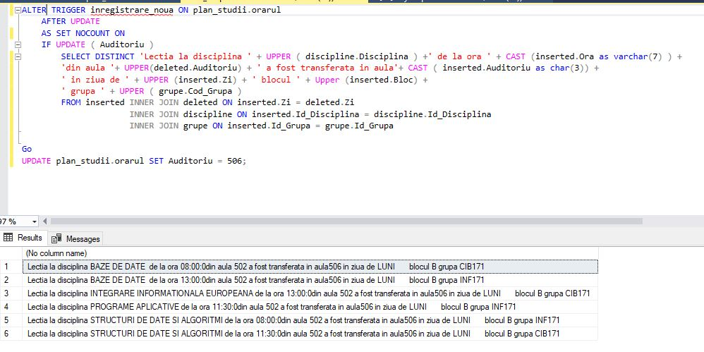
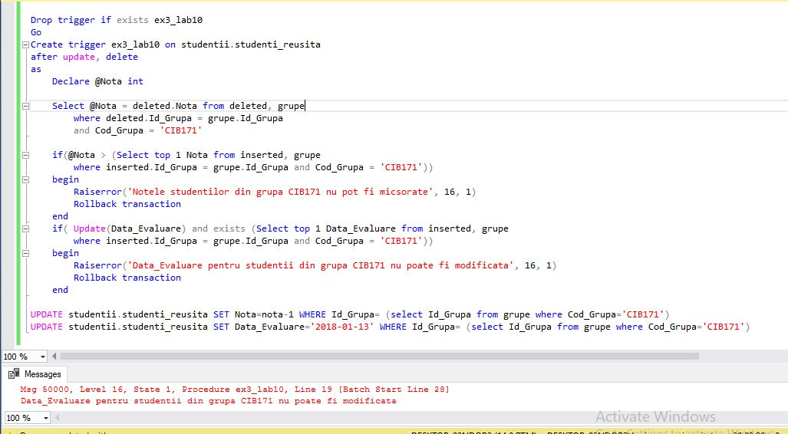
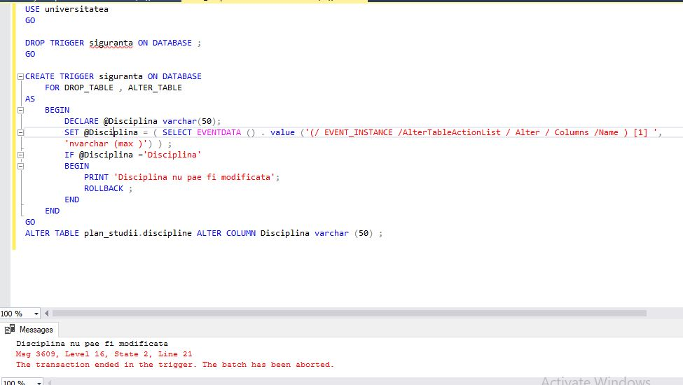
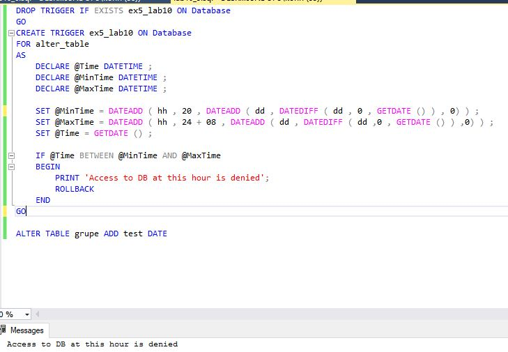

# Laboratory work nr. 9 by Sclifos Corina

## Tasks
**1** 



**2** 


**3** 


**4** 


**5** 
```sql

```


**6** 

```sql
DROP TRIGGER IF EXISTS ex6_lab10 ON database
GO
CREATE TRIGGER ex6_lab10 ON database
FOR alter_table 
AS
	Declare @Id_Profesor varchar(50)
	Declare @event1 varchar(500)
	Declare @event2 varchar(500)
	Declare @event3 varchar(100)
	SELECT @Id_Profesor=EVENTDATA().value('(/EVENT_INSTANCE/AlterTableActionList/*/Columns/Name)[1]', 'nvarchar(100)') 
	
	IF @Id_Profesor='Id_Profesor'
	BEGIN
	SELECT @event1 = EVENTDATA().value('(/EVENT_INSTANCE/TSQLCommand/CommandText)[1]','nvarchar(max)') 
	SELECT @event3 = EVENTDATA().value('(/EVENT_INSTANCE/ObjectName)[1]','nvarchar(max)') 
	SELECT @event2 = REPLACE(@event1, @event3, 'profesori');
	EXECUTE (@event2) 
	SELECT @event2 = REPLACE(@event1, @event3, 'orarul');
	EXECUTE (@event2) 
	SELECT @event2 = REPLACE(@event1, @event3, 'studenti_reusita');
	EXECUTE (@event2)   
	PRINT 'Datele au fost modificate'   
	END 
GO
ALTER TABLE cadre_didactice.profesori ALTER column Id_Profesor SMALLINT 
ALTER TABLE studentii.studenti_reusita ALTER column Id_Profesor SMALLINT 

```
