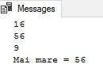
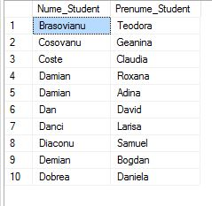
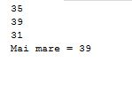

# Laboratory work nr. 5 by Sclifos Corina

## Answers to questions
1. **Types of blocks in Transact SQL.**
	There are 3 types of blocks:
  * Anonymous blocks: these are Transact SQL blocks, which are defined within an application and do not have names.
  * Procedures: These are Transact SQL blocks, which have a name, have input parameters, but not
have explicit output parameters.
  * Functions: These are Transact SQL blocks, which have a name, have input parameters, and everything
time returns a value
2. **Presentation of variables.**
* Local variable - A Transact-SQL block can be built from other sections, such as the declarative one. The section
the declaratory begins with the DECLARE instruction and is optional!; it may contain a number of statements,
including variables.
In the Transact-SQL language, local variables can be used to store some values that can be
tested or modified, in addition, ensures the transfer of data to and from database tables. variables
local areas have as their domain the lot, procedure or block in which they were declared. 
* Glogal variable - SQL Server offers a large number of global variables that are very effective to be
used in Transact-SQL. Global variables are a special type of variable. server always maintain the values of these variables. All global variables represent information server-specific or a current user session.
Global variable names begin with @@ prefix. They do not have to be declared because
the server keeps them constant. In other words, they are functions defined by the system and can not be
declared.
	- @@ERROR
	- @@IDENTITY
	- @@VERSION
	- @@SERVERNAME
	- @@LANGUAGE
	- @@MAX CONNECTIONS

3. **Explain the loop WHILE **

   Repetitive control structures perform certain code sequences of a number determined by times. into the
the Transact-SQL system, there is a possibility - the application of the WHILE operator. WHILE operator tests
a boolean condition and repeatedly executing an instruction or instruction block. Execution of these
instructions will be repeated as long as the specified condition remains true.
```sql
WHILE <expresie_booleana>
{ <instructiune_sql> I <bloc instructiuni sql> I BREAK I CONTINUE }
```

4. **Explain the structure CASE**
   Parts of SQL statements can be executed conditionally. For example, a column of the query results
can be formatted according to the values contained in another column.
```sql
CASE <expresie_intrare>
	WHEN <expresie_comparare> THEN <expresie_rezultat>
	[WHEN <expresie_comparare> THEN <expresie_rezultat> ... ]
	[ELSE <expresie_rezultat_alternativ>]
END
```

5. **Explain the instruction IF-ELSE**
 The alternate control structure modifies the workflow by executing or not executing certain code sequences,
depending on the fulfillment or non-fulfillment of certain conditions. Probably the most commonly used structure
flow control is IF. .. ELSE.
```sql
IF <expresie_booleana>
	{ <instructiune_sqll> I <bloc instructiuni sqll> }
     [ ELSE
	{ <instructiune_sql2> I <bloc instructiuni sql2> } ]
```

6. **EXCEPTIONS** 
   Exceptions are problems (usually errors) that do not allow the program to continue. This thing
it is due to the lack of sufficient information, and control is therefore passed to another program.
Treating exceptions is a relatively simple means of determining errors, presents the mechanism of
direct error indication and viewing and checking the exception m compilation process.
  There are two ways to manage errors. The first is to set up a structure of the TRY exception
the instruction block to be tested, and m CATCH (structured error handling), the error
which must be lifted. The second way is to test the value of the system variable @@ ERROR (treating
unstructured error).
```sql
BEGIN TRY
	{instructiune_sqllbloc_sql}
END TRY

BEGIN CATCH
	[{instructiune_sqllbloc_sql}]
END CATCH ( ; ]
````

## Practical Tasks
**1**
Gasiti numele, adresa studentilor si codul disciplinei la care studentii au avut eel putin o nota mai
mare decat 8 in 2018.
```sql
SELECT Nume_Student , Adresa_Postala_Student, Id_Disciplina
FROM studenti, studenti_reusita
WHERE Nota > 8 and Data_Evaluare like '%2018%';
```


**2**
In ce grupe de studii (Cod_ Grupa) figureaza mai mult de 24 de studenti?
```sql
select grupe.Cod_Grupa, COUNT(DISTINCT studenti.Id_Student) from grupe
	inner join studenti_reusita on grupe.Id_Grupa=studenti_reusita.Id_Grupa
	inner join studenti on studenti_reusita.Id_Student=studenti.Id_Student
	group by grupe.Id_Grupa, grupe.Cod_Grupa
	having COUNT(DISTINCT studenti.Id_Student) > 24;
```


## Task 3
Sa se obtina lista disciplinelor (Disciplina) sustinute de studenti cu nota medie de promovare la
examen mai mare de 7, in ordine descrescatoare dupa denumirea disciplinei.
```sql
select discipline.Disciplina, AVG(studenti_reusita.Nota) as Media from discipline
	inner join studenti_reusita on discipline.Id_Disciplina=studenti_reusita.Id_Disciplina
	where Tip_Evaluare like '%Examen%'
	group by discipline.Disciplina
	having AVG(studenti_reusita.Nota)>7
	order by discipline.Disciplina DESC;
```


## Task 4
Sa se obtina lista disciplinelor (Disciplina) sustinute de studenti cu nota medie de promovare la
examen mai mare de 7, in ordine descrescatoare dupa denumirea disciplinei.
```sql
select discipline.Disciplina, AVG(studenti_reusita.Nota) as Media from discipline
	inner join studenti_reusita on discipline.Id_Disciplina=studenti_reusita.Id_Disciplina
	where Tip_Evaluare like '%Examen%'
	group by discipline.Disciplina
	having AVG(studenti_reusita.Nota)>7
	order by discipline.Disciplina DESC;
```

