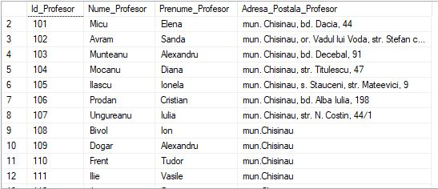

# Laboratory work nr. 6 by Sclifos Corina

## Tasks
**1**

Write a T-Sql instruction, that will populate the column "Adresa _ Postala _ Profesor" from table "profesori" with value "mun.Chisinau", where the column value is NULL 

```sql
use universitatea
go

update profesori Set Adresa_Postala_Profesor = 'mun.Chisinau' where Adresa_Postala_Profesor is NULL
```


**2**
Afi~ati primele zece date (numele, prenumele studentului) in functie de valoarea notei (cu exceptia
notelor 6 si 8 a studentului la primul test al disciplinei Baze de date , folosind structura de
altemativa IF. .. ELSE. Sa se foloseasca variabilele.
```sql
Declare @Nota1 int, @Nota2 int;
Set @Nota1 = 6;
Set @Nota2 = 8;

SELECT TOP 10 Nume_Student, Prenume_Student FROM studenti
inner join studenti_reusita on studenti_reusita.Id_Student=studenti.Id_Student
inner join discipline on discipline.Id_Disciplina=studenti_reusita.Id_Disciplina
WHERE Disciplina like '%Baze de date %' and Tip_Evaluare like '%Testul 1%' and Nota IN (iif ( Nota <> @Nota1 and Nota <> @Nota2, Nota, null ) )
```


**3**
Rezolvati aceesi sarcina, 1, apeland la structura selectiva CASE.
```sql
DECLARE @N1 INT, @N2 INT, @N3 INT;
DECLARE @MAI_MARE INT;
SET @N1 = 60 * RAND();
SET @N2 = 60 * RAND();
SET @N3 = 60 * RAND();


SET @MAI_MARE = CASE WHEN @n1 > @n2 THEN @n1 ELSE @n2 END
SET @MAI_MARE = CASE WHEN @n3 > @MAI_MARE THEN @n3 ELSE @MAI_MARE END

PRINT @n1
PRINT @n2
PRINT @n3
PRINT 'Mai mare = ' + CAST(@MAI_MARE AS VARCHAR(2));
```


**4**
Modificati exercitiile din sarcinile 1 si 2 pentru a include procesarea erorilor cu TRY si CATCH, si
RAISERRROR.
```sql
DECLARE @N1 INT, @N2 INT, @N3 INT;
DECLARE @MAI_MARE INT;
SET @N1 = 60 * RAND();
SET @N2 = 60 * RAND();
SET @N3 = 60 * RAND();

BEGIN TRY
	if @N1 > @N2
		select @MAI_MARE = @N1
	else
		select @MAI_MARE = @N2

	if @MAI_MARE > @N3
		select @MAI_MARE = @MAI_MARE
	else
		select @MAI_MARE = @N3

	RAISERROR ('Error1', 16, 1);

END TRY
BEGIN CATCH
    PRINT 'ERROR: ' + ERROR_MESSAGE()
END CATCH

PRINT @N1;
PRINT @N2;
PRINT @N3;
PRINT 'Mai mare = ' + CAST(@MAI_MARE AS VARCHAR(2));

```


```sql
if (select COUNT(Id_Student) from studenti) < 10
	begin
		raiserror('Students are less then 10', 16, 1)
	end
else
	Begin try
		Declare @Nota1 int, @Nota2 int;
		Set @Nota1 = 6;
		Set @Nota2 = 8;

		SELECT TOP 10 Nume_Student, Prenume_Student FROM studenti
		inner join studenti_reusita on studenti_reusita.Id_Student=studenti.Id_Student
		inner join discipline on discipline.Id_Disciplina=studenti_reusita.Id_Disciplina
		WHERE Disciplina like '%Baze de date %' and Tip_Evaluare like '%Testul 1%' and 
		      Nota IN (iif ( Nota <> @Nota1 and Nota <> @Nota2, Nota, null ) )
	end try 


```

