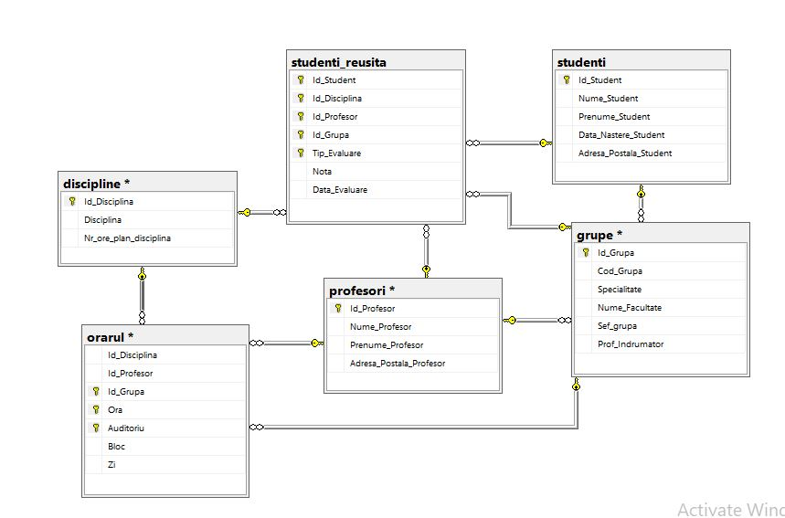
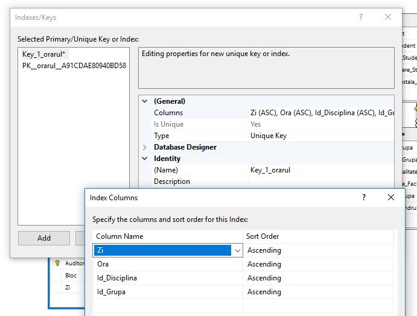
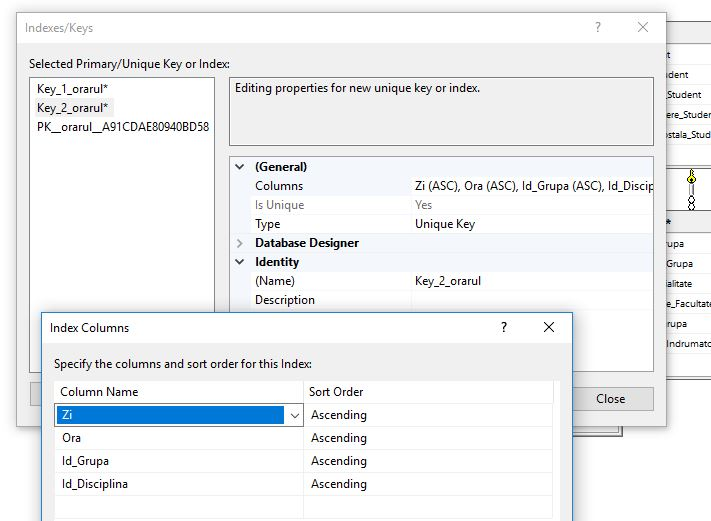
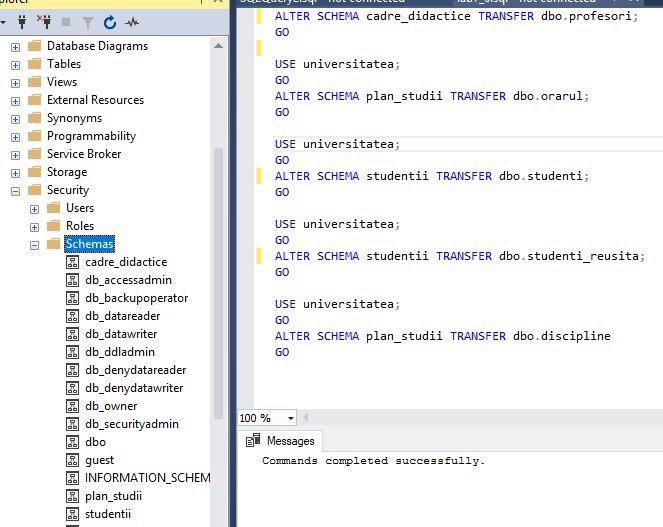

# Laboratory work nr. 7 by Sclifos Corina

## Tasks
**1** Create the diagram of university database, that will include the following tables: Profesori, Studenti, Studenti_reusita, Grupe, Discipline 


**2** Add the referential constraints with tables studenti and profesori for columns Sef_grupa and Prof_indrumator from table grupe


**3** Add to the existing diagram from ex1, another table from your database: orarul 



**4** The table should contain 2 secondar keys:(Zi,Ora, Id_Grupa, Id_Profesor) and (Zi, Ora , Id_Grupa, Id_Disciplina) 




**5** In the diagram also should be shown the constraints (FK-PK) for atributes: Id_Disciplina, Id_Profesor and Id_Grupa between table orarul and tables discipline, profesori and grupe .(In the ex3 , I have already indicated those constraints) 


**6** Modify 2-3 queries from laboratory nr.4, taking in considerations that table's schemas were changed  

```sql
USE universitatea; 
GO 
ALTER SCHEMA cadre_didactice TRANSFER dbo.profesori; 
GO 

USE universitatea; 
GO 
ALTER SCHEMA plan_studii TRANSFER dbo.orarul; 
GO 

USE universitatea; 
GO 
ALTER SCHEMA studentii TRANSFER dbo.studenti; 
GO 

USE universitatea; 
GO 
ALTER SCHEMA studentii TRANSFER dbo.studenti_reusita; 
GO 

USE universitatea; 
GO 
ALTER SCHEMA plan_studii TRANSFER dbo.discipline
GO 
```


**7** Modify 2-3 queries from laboratory nr.4, taking in considerations that table's schemas were changed 
```sql
aselect Nume_Student , Adresa_Postala_Student, Id_Disciplina
from studentii.studenti, studentii.studenti_reusita
where Nota > 8 and Data_Evaluare like '%2018%';

select grupe.Cod_Grupa, COUNT(DISTINCT studenti.Id_Student) from grupe
	inner join studentii.studenti_reusita on grupe.Id_Grupa=studenti_reusita.Id_Grupa
	inner join studentii.studenti on studenti_reusita.Id_Student=studenti.Id_Student
	group by grupe.Cod_Grupa
	having COUNT(DISTINCT studenti.Id_Student) > 24;

select discipline.Disciplina, AVG(studenti_reusita.Nota) as Media from plan_studii.discipline
	inner join studentii.studenti_reusita on discipline.Id_Disciplina=studenti_reusita.Id_Disciplina
	where Tip_Evaluare like '%Examen%'
	group by discipline.Disciplina
	having AVG(studenti_reusita.Nota)>7
	order by discipline.Disciplina DESC;
```


**8** Write the queries necessary for creating te indexes on tables from "University" database to ensure a higher performance to the queries from laboratory work number 4. Analyse the results.
The indexes must be physically placed into userdatafgroup file group 
```sql
select Nume_Student , Adresa_Postala_Student, Id_Disciplina
from studentii.studenti, studentii.studenti_reusita
where Nota > 8 and Data_Evaluare like '%2018%';

select grupe.Cod_Grupa, COUNT(DISTINCT studenti.Id_Student) from grupe
	inner join studentii.studenti_reusita on grupe.Id_Grupa=studenti_reusita.Id_Grupa
	inner join studentii.studenti on studenti_reusita.Id_Student=studenti.Id_Student
	group by grupe.Cod_Grupa
	having COUNT(DISTINCT studenti.Id_Student) > 24;

select discipline.Disciplina, AVG(studenti_reusita.Nota) as Media from plan_studii.discipline
	inner join studentii.studenti_reusita on discipline.Id_Disciplina=studenti_reusita.Id_Disciplina
	where Tip_Evaluare like '%Examen%'
	group by discipline.Disciplina
	having AVG(studenti_reusita.Nota)>7
	order by discipline.Disciplina DESC;
```


