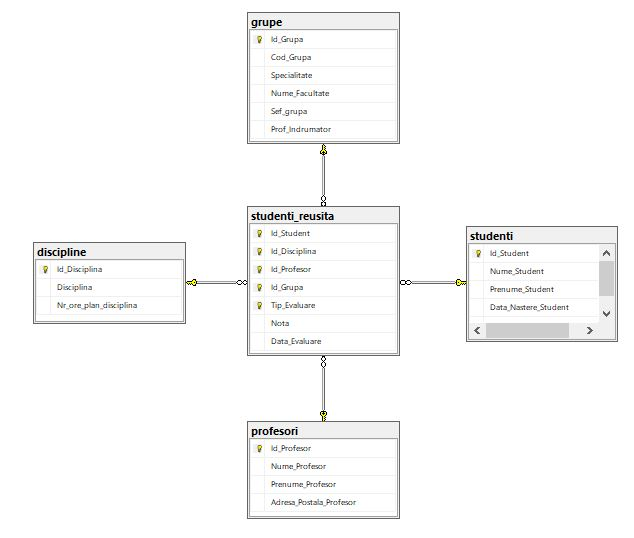
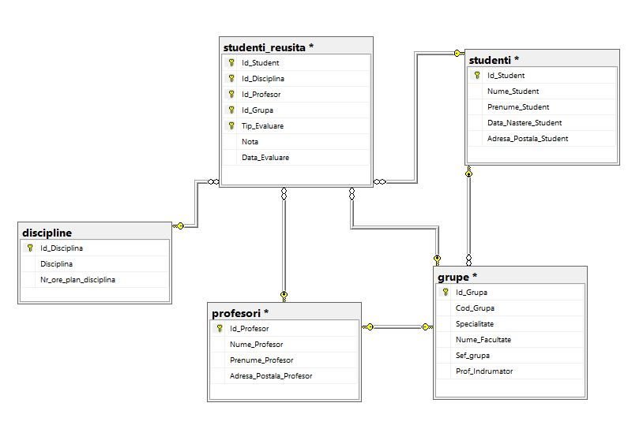

# Laboratory work nr. 7 by Sclifos Corina

## Tasks
**1** Create the diagram of university database, that will include the following tables: Profesori, Studenti, Studenti_reusita, Grupe, Discipline 



**2** Add the referential constraints with tables studenti and profesori for columns Sef_grupa and Prof_indrumator from table grupe



**3**
Add 2 columns: *Sef_Grupa* ; *Prof_Indrumator* of type Int, to the table named *grupe*. Populate the given column fields with values according to the following
criteria:
* *Seful_grupei* should have the best average mark from his group  on all disciplines and all types of evaluation.
* *Prof_Indrumator* column should teach a maximum number of disciplines for this group. If there are more candidates that correspond to 
this conditions, then get the teacher with the minimal Id from the teachers that correspond to the previous criteria. The values inthis columns should be unique
* Write ALTER, INSERT, UPDATE instruction, necessary for creating the given fields, for selecting the corresponding candidates and  data insertion.
```sql
alter table grupe add Sef_grupa int, Prof_Indrumator int;
```
```sql

update grupe set Sef_grupa = (Select top 1 Id_Student
				from studenti_reusita sr1
				where grupe.Id_Grupa = sr1.Id_Grupa
				group by Id_Student
				order by ROUND(AVG(CAST(Nota AS FLOAT)), 2) desc)

update grupe set Prof_Indrumator = (select top 1 Id_Profesor
						from studenti_reusita sr2
						where sr2.Id_Grupa = grupe.Id_Grupa
						group by Id_Profesor
						order by Count(Id_Disciplina) desc, Id_Profesor)
select * from grupe
```


**4**
Write a T-SQL instruction, that will increase the marks of all group-leads with one point 
```sql
use universitatea
go

update studenti_reusita set nota = nota + 1  where Id_Student in (Select Sef_grupa from grupe) and nota < 10
select * from studenti_reusita
```
**5** Create a table named "profesori_new", with columns: Id_Profesor, Nume_Profesor, Prenume_Profesor, Localitate, Adresa_1, Adresa_2
* Id_Profesor - primary key, CLUSTERED
* Localitate - have default value mun.Chisinau
* Insert data from table "profesori" to the new table,
```sql
create table profesori_new (
	Id_Profesor int,
	Nume_Profesor varchar(60),
	Prenume_Profesor varchar(60),
	Localitate varchar(60) default('mun.Chisinau'),
	Adresa_1 varchar(60),
	Adresa_2 varchar(60),
	Primary key clustered(Id_Profesor));

```
```sql
Insert into profesori_new(Id_Profesor, Nume_Profesor, Prenume_Profesor, Localitate, Adresa_1, Adresa_2)
select Id_Profesor, Nume_Profesor, Prenume_Profesor,
case 
	when charindex('str.', Adresa_Postala_Profesor) > 0 then
		SUBSTRING(Adresa_Postala_Profesor, 1, CHARINDEX(', str.', Adresa_Postala_Profesor) - 1)
	when charindex('bd.', Adresa_Postala_Profesor) > 0 then 
		SUBSTRING(Adresa_Postala_Profesor, 1, CHARINDEX(', bd.', Adresa_Postala_Profesor) - 1)
	when charindex('mun.', Adresa_Postala_Profesor) > 0 then 
		SUBSTRING(Adresa_Postala_Profesor, 1, len(Adresa_Postala_Profesor))
end,

case 
	when charindex('str.', Adresa_Postala_Profesor) > 0 then
		SUBSTRING(Adresa_Postala_Profesor, CHARINDEX(' str.', Adresa_Postala_Profesor)+1, patindex('%, [0-9]%', Adresa_Postala_Profesor) - CHARINDEX(', str.', Adresa_Postala_Profesor))
	when charindex('bd.', Adresa_Postala_Profesor) > 0 then 
		SUBSTRING(Adresa_Postala_Profesor, CHARINDEX(' bd.', Adresa_Postala_Profesor)+1, patindex('%, [0-9]%', Adresa_Postala_Profesor) - CHARINDEX(', bd.', Adresa_Postala_Profesor))
end,

case 
	when patindex('%, [0-9]%', Adresa_Postala_Profesor) > 0 then 
		SUBSTRING(Adresa_Postala_Profesor, patindex('%, [0-9]%', Adresa_Postala_Profesor) + 1, len(Adresa_Postala_Profesor) - patindex('%, [0-9]%', Adresa_Postala_Profesor) + 1)

end

from profesori
select * from profesori_new
```


**6** Insert the next data in "orar" table, for the group CIB171, with Id_Group = 1, for Monday. All lessons will take place in studies block 'B' 

```sql
create table orarul (
Id_Disciplina int,
Id_Profesor int,
Id_Grupa int,
Ora time,
Auditoriu int,
Bloc char(1),
Zi char(10)
primary key(Id_Disciplina, Id_Profesor, Id_Grupa));
```
```sql
insert into orarul (Id_Disciplina, Id_Profesor, Id_Grupa, Ora, Auditoriu, Bloc, Zi)
values(107, 101, 1, '08:00', 202, 'B', 'Luni'),
	  (108, 101, 1, '11:30', 501, 'B', 'Luni'),
      (119, 117, 1, '13:00', 501, 'B', 'Luni')

select * from orarul
```


**7** Write T-SQL instructions neccessary for populating the "orar" table for INF171 group, for Monday.
```sql
alter table orarul add constraint default_bloc default 'B' for Bloc

insert into orarul (Id_Disciplina, Id_Profesor, Id_Grupa, Ora, Auditoriu, Bloc, Zi)
values((Select Id_Disciplina from discipline where Disciplina = 'Structuri de date si algoritmi'),
	   (Select Id_Profesor from profesori where Nume_Profesor = 'Bivol' and Prenume_Profesor = 'Ion'), 
	   (Select Id_Grupa from grupe where Cod_Grupa = 'INF171'), '08:00', 502, 'B', 'Luni'),

	  ((Select Id_Disciplina from discipline where Disciplina = 'Programe aplicative'),
	   (Select Id_Profesor from profesori where Nume_Profesor = 'Mircea' and Prenume_Profesor = 'Sorin'), 
	   (Select Id_Grupa from grupe where Cod_Grupa = 'INF171'), '11:30', 502, 'B', 'Luni'),

      ((Select Id_Disciplina from discipline where Disciplina = 'Baze de date'),
	   (Select Id_Profesor from profesori where Nume_Profesor = 'Micu' and Prenume_Profesor = 'Elena'), 
	   (Select Id_Grupa from grupe where Cod_Grupa = 'INF171'), '13:00', 502, 'B', 'Luni')


```


**8** Write the queries necessary for creating te indexes on tables from "University" database to ensure a higher performance to the queries from laboratory work number 4. Analyse the results.
The indexes must be physically placed into userdatafgroup file group 
```sql

alter database universitatea
add filegroup userdatafgroup1
go

alter database universitatea
add file(
	name = IndexLab6,
	filename =  'E:\SQL_BD\DATA\IndexLab6\userdatafgroup1.ndf',
	SIZE = 10MB,
	MAXSIZE = 100MB,
	filegrowgh = 10% )

to filegroup userdatafgroup1
go

create nonclustered index create_index on grupe(Id_Grupa) on [userdatafgroup1]
```


