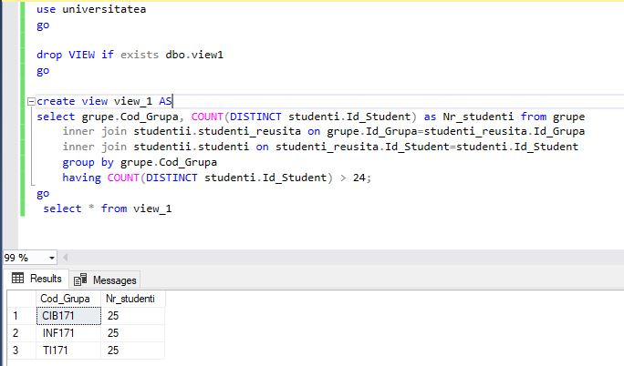
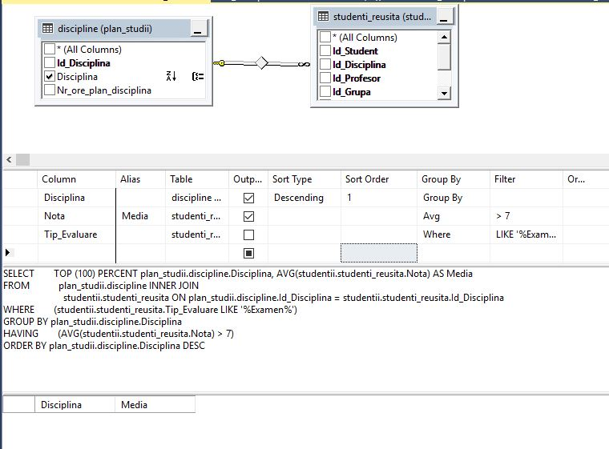

# Laboratory work nr. 8 by Sclifos Corina

## Tasks
**1** Create two views base on query made in laboratory work nr.4. Create views in two different ways.




**2** Apply instructions INSERT, UPDATE, DELITE on created views.
```sql
insert into dbo.view_1 (Cod_Grupa, Nr_studenti)   
values ('SI161', '27'); 
go

update dbo.view_1 set Cod_Grupa = '%FAF161%'
	where Cod_Grupa = '%INF171%';
go

DELETE FROM dbo.view_1
      WHERE Cod_Grupa = '%TI171%'
GO

insert into dbo.view_2 (Disciplina, Media)   
values ('APA', '9'); 
go

update dbo.view_2 set Disciplina = '%Sisteme de operare%'
	where Media < 5
go

DELETE FROM dbo.view_2
      WHERE Disciplina = '%Tehnologii de procesare a informatiei%'
GO
```
Unfortunately, I was unable to execute these instructions because of the restrictions:
* Any modifications, including UPDATE, INSERT, and DELETE statements, must reference columns from only one base table.
* The columns being modified in the view must directly reference the underlying data in the table columns. The columns cannot be derived in any other way, such as through the following:
* An aggregate function: AVG, COUNT, SUM, MIN, MAX, GROUPING, STDEV, STDEVP, VAR, and VARP.
* A computation. The column cannot be computed from an expression that uses other columns. Columns that are formed by using the set operators UNION, UNION ALL, CROSSJOIN, EXCEPT, and INTERSECT amount to a computation and are also not updatable.
* The columns being modified are not affected by GROUP BY, HAVING, or DISTINCT clauses.

**3** Add to the existing diagram from ex1, another table from your database: orarul 


**4** The table should contain 2 secondar keys:(Zi,Ora, Id_Grupa, Id_Profesor) and (Zi, Ora , Id_Grupa, Id_Disciplina) 


**5** In the diagram also should be shown the constraints (FK-PK) for atributes: Id_Disciplina, Id_Profesor and Id_Grupa between table orarul and tables discipline, profesori and grupe .(In the ex3 , I have already indicated those constraints) 


**6** Modify 2-3 queries from laboratory nr.4, taking in considerations that table's schemas were changed  

```sql

```


**7** Modify 2-3 queries from laboratory nr.4, taking in considerations that table's schemas were changed 
```sql

```


**8** Create synonyms in order to simplify the queries from the previous exercise. 
```sql

```
