# Laboratory work nr. 9 by Sclifos Corina

## Tasks
**1** 

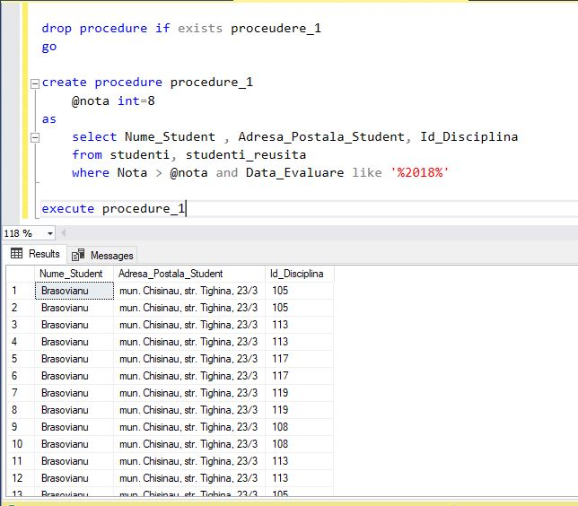
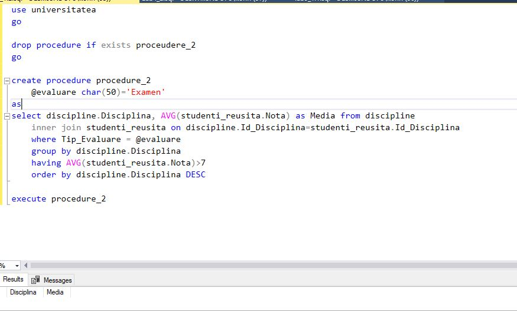

**2** 
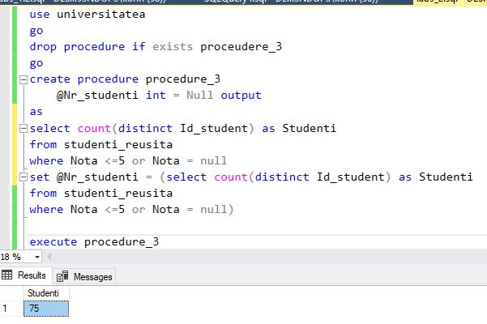

**3** 
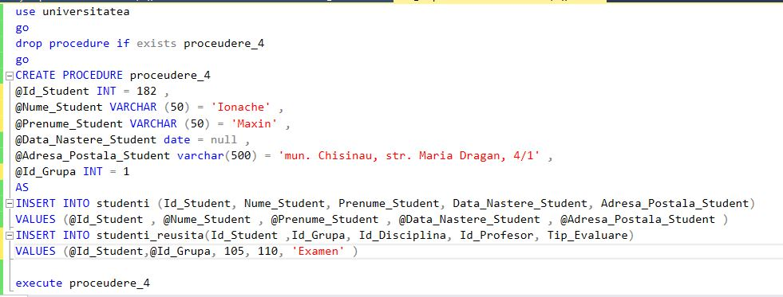
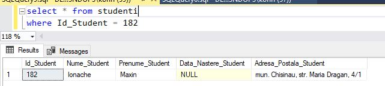
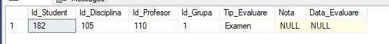

**4** 
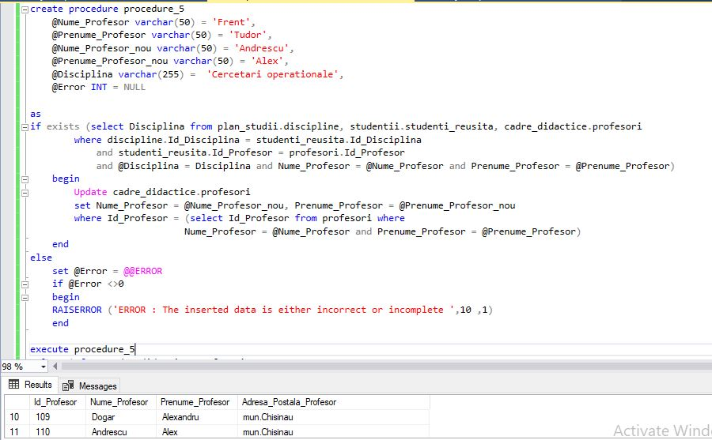

**5** 
```sql
use universitatea
go 
drop procedure if exists procedure_6 
go
create procedure procedure_6
	@Discipline varchar(50)
	as
    Declare @students table(Id_Student int, media decimal)
	insert into @students
	
	select top 3 studenti_reusita.Id_Student, Avg(Nota) as media
	from studentii.studenti, studentii.studenti_reusita, plan_studii.discipline
	where studenti.Id_Student = studenti_reusita.Id_Student
	and studenti_reusita.Id_Disciplina = discipline.Id_Disciplina
	and  Disciplina = @Discipline
	group by (studenti_reusita.Id_Student)
	order by(media) desc
	 
	 select Cod_Grupa, concat(Nume_Student, ' ', Prenume_Student) as Nume_Prenume_Student, Disciplina, nota as Nota_Veche, 
			iif(nota <= 9, nota+1, nota) as Nota_Noua
	 from studentii.studenti, studentii.studenti_reusita, grupe, plan_studii.discipline
	 where studenti.Id_Student = studenti_reusita.Id_Student 
	 and studenti_reusita.Id_Grupa = grupe.Id_Grupa 
	 and studenti_reusita.Id_Disciplina = discipline.Id_Disciplina
	 and Tip_Evaluare = 'Examen' and studenti.Id_Student in (select Id_Student from @students) and Disciplina = @Discipline


update studentii.studenti_reusita 
set Nota = (Nota + 1) where Id_Student in (
	select Id_Student from @students 
	where Tip_Evaluare = 'Examen' and Nota < 10
	and Id_Disciplina = (select Id_Disciplina from plan_studii.discipline where Disciplina = @Discipline))
go

execute procedure_6 'Baze de date'
```
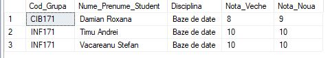

**6** 

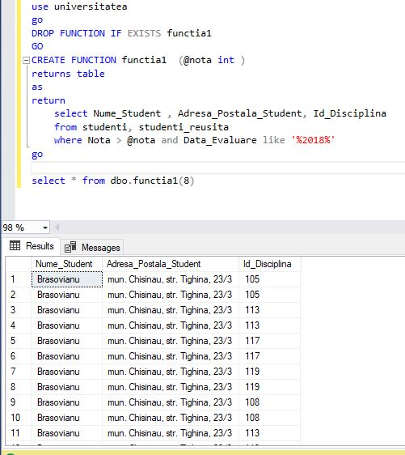
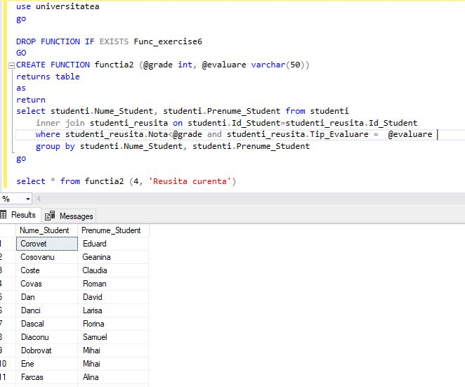

**7** 

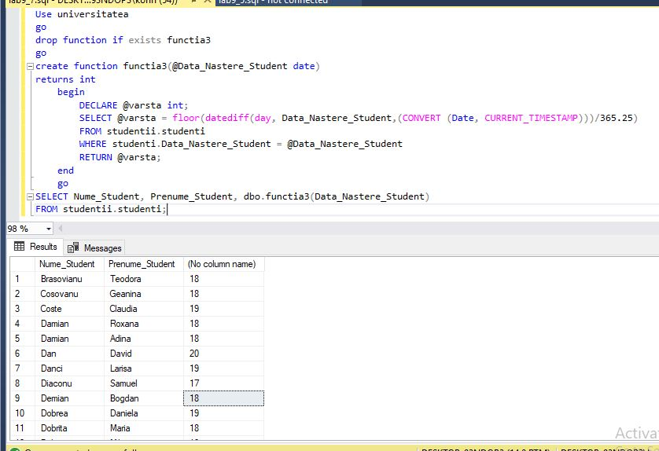

**8** 

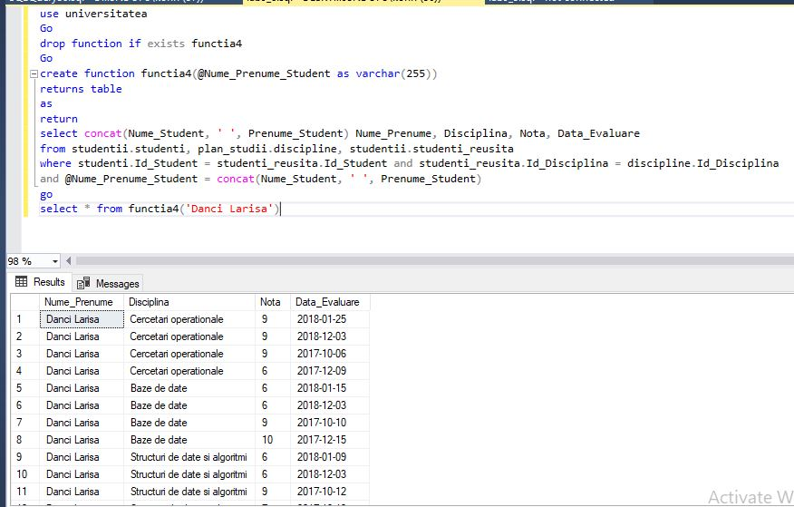

**9** 

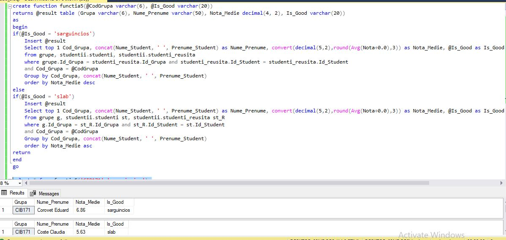

